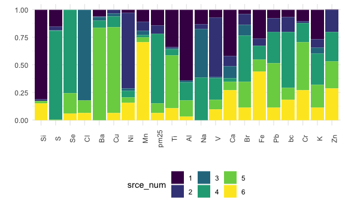

APCA
================
Rachel Tao
1/2/2021

Load in data

``` r
# dataset should include date, total pm2.5, and pm2.5 components

conc <- read_csv("./data/concentrations9910.csv") %>% 
  mutate(
    date = as.Date(date, "%m/%d/%Y"))

# multiply all concentrations by 1000 for units
i <- c(2:22)
conc[ , i] <- apply(conc[ , i], 2,
                    function(x)
                      x*1000)
```

Means, correlations and variances

``` r
conc_corr <- 
  conc %>% 
  select(-date)

corr <- 
  summarize(conc_corr, corr = cor(conc_corr, use = "pairwise.complete.obs"))

conc_summarize <- 
  conc_corr %>% 
  pivot_longer(everything(),
               names_to = "element",
               values_to = "concentration") %>% 
  group_by(element)

means <- conc_summarize %>% 
  summarize(mean = mean(concentration, na.rm = TRUE)) %>% 
  arrange(element)

vars <- conc_summarize %>% 
  summarize(variance = var(concentration, na.rm = TRUE)) %>% 
  arrange(element)
```

Scaled factor analysis - must provide number of factors here

``` r
# set mean = 0, SD = 1
# remove potassium so that 4th of July fireworks do not alter overall results
zspec_pm25 <- 
  conc %>% 
  select(-date, -pm25, -K) %>% 
  scale(center = TRUE, scale = TRUE)

# factor analysis - must provide number of factors!
factors <- 
  fa(zspec_pm25,
     nfactors = 6, max.iter = 500,
     rotate = "varimax",
     scores = "regression",
     SMC  = TRUE,
     fm = "pa")

# calculate factor scores, loadings, and weights (aka standardized scoring coefficients)
fact <- as_tibble(factors$scores)
loadings <- factors$loadings
factor_stat <- factors$weights %>% 
  as_tibble(rownames = NA) %>% 
  rownames_to_column("element") %>% 
  arrange(element)
```

calculate absolute factor scores for each day (Equations 5-7 in
statistical methods of Kavouras 2001)

``` r
# join standardized scoring coefficients with means and variances
coeff <- left_join(means, vars, by = "element") %>% 
  left_join(factor_stat, by = "element")

# calculate minimum values to find absolute factor scores (equations 5 and 6)
min <- coeff %>% 
  pivot_longer(contains("PA"),
               names_to = "factor_num",
               names_prefix = "PA",
               values_to = "factor_coeff") %>% 
  mutate(minimum = factor_coeff*(-mean/(variance^(1/2)))) %>% 
  select(element, factor_num, minimum) %>% 
  group_by(factor_num) %>% 
  summarize(sum = sum(minimum, na.rm = TRUE)) %>% 
  pivot_wider(factor_num:sum,
              names_from = factor_num,
              names_prefix = "minimum_",
              values_from = sum)

# reattach factor scores to dates and calculate absolute factor scores for each day
# (equation 7)
a <- conc %>% 
  select(date) %>% 
  cbind(fact) %>% 
  pivot_longer(contains("PA"),
               names_to = "factor_num",
               names_prefix = "PA",
               values_to = "factor_score") %>% 
  mutate(factor_num = as.numeric(factor_num)) %>% 
  cbind(min) %>% 
  pivot_longer(contains("minimum"),
               names_to = "min_num",
               names_prefix = "minimum_",
               values_to = "minimum") %>% 
  mutate(min_num = as.numeric(min_num)) %>% 
  filter(factor_num == min_num) %>% 
  mutate(factor_score = factor_score - minimum) %>% 
  select(-min_num, -minimum)
```

factor means

``` r
# this is a check - not necessary for next steps
factor_means <- a %>% 
  select(factor_num, factor_score) %>% 
  group_by(factor_num) %>% 
  summarize(mean_score = mean(factor_score, na.rm = TRUE))
```

Regress each element on factors to see source contribution

``` r
# define 'regress' as regression function with y as dependent variable and x as independent variable(s)
# return tidy output for beta values and r-squared value
regress = function(y) {
  
  z = lm(y ~ x)
  
  r.squared = broom::glance(z) %>% select(r.squared)

  betas = broom::tidy(z) %>% pivot_wider(term:estimate,
                                         names_from = "term",
                                         values_from = "estimate")
  
  return(cbind(r.squared, betas))
  
}

# independent variables for regression will be factors from factor analysis. define these as 'x'
x <- a %>% 
  pivot_wider(everything(),
              names_from = factor_num,
              names_prefix = "factor_",
              values_from = factor_score) %>% 
  select(contains("factor")) %>% as.matrix()

# dependent variable for regression will be actual element concentration. define this as y.
y <- conc %>% select(-date)

# repeat 'regress' for each element using 'x' as factors and 'y' as concentrations)
regress <- map(y, regress) %>% 
  enframe(name = "element") %>% 
  unnest(c(value)) %>% 
  janitor::clean_names() %>% 
  rename_at(vars(contains("factor")), funs(str_replace(., "xfactor", "beta")))

# dataset storing r-squred values
r <- regress %>% 
  select(element, r_squared)

# dataset storing beta values
betas <- regress %>% 
  select(element, starts_with("beta")) %>% 
  nest(betas = starts_with("beta"))
```

calculate source contributions

``` r
# combine betas with factor scores in a list 
sources = lapply(betas$betas, cbind, a)

# in the above step, element names are automatically removed. rename list elements
names(sources) <- betas$element

# calculate source contributions by multiplying absolute factor scores by beta values
sources <- lapply(sources, as_tibble) %>% 
  bind_rows(.id = "element") %>%
  pivot_longer(starts_with("beta"),
               names_to = "beta_num",
               names_prefix = "beta_",
               values_to = "beta_value") %>% 
  mutate(
    beta_num = as.numeric(beta_num)
  ) %>% 
  filter(factor_num == beta_num) %>% 
  mutate(
    srce = factor_score*beta_value
  ) %>% 
  mutate(srce_num = as.character(beta_num)) %>% 
  select(element, date, srce_num, srce) 

conc_long <- conc %>% 
  pivot_longer(!date,
               names_to = "element",
               values_to = "concentration") %>% 
  arrange(element)

source_conc <- left_join(sources, conc_long, by = c('element', 'date'))

# calculate mean source contributions for each element
mean_source <- source_conc %>% 
  group_by(element, srce_num) %>% 
  summarize(source_mean = mean(srce, na.rm = TRUE),
            MeanConc = mean(concentration, na.rm = TRUE)) %>% 
  pivot_wider(names_from = "srce_num",
              names_prefix = "source_",
              values_from = "source_mean")
```

### Final datasets and visualizations:

``` r
# calculate mean predicted concentration and percent error
SA_Varimax <- mean_source %>% 
  ungroup(element) %>% 
  left_join(r, by = "element") %>% 
  mutate(
    PredConc = reduce(select(., contains("source")), `+`),
    Pct_error = round(((PredConc - MeanConc)/MeanConc)*100, digits = 2)
  )

i <- c(2:11)
SA_Varimax[ , i] <- apply(SA_Varimax[ , i], 2,
                    function(x)
                      round(x, digits = 3))

SA_Varimax %>% kable()
```

| element | MeanConc | source\_1 | source\_2 | source\_3 | source\_4 | source\_5 | source\_6 | r\_squared |  PredConc | Pct\_error |
| :------ | -------: | --------: | --------: | --------: | --------: | --------: | --------: | ---------: | --------: | ---------: |
| Al      |   49.426 |    32.577 |     0.078 |     0.761 |     8.202 |     7.408 |     1.615 |      0.977 |    50.641 |       2.46 |
| Ba      |    8.662 |     0.411 |     0.018 |     0.229 |     0.422 |     5.437 |   \-0.153 |      0.308 |     6.365 |    \-26.52 |
| bc      |  714.555 |    37.980 |    72.891 |  \-18.438 |   278.533 |    59.691 |   101.568 |      0.494 |   532.225 |    \-25.52 |
| Br      |    0.861 |     0.048 |     0.118 |     0.114 |     0.505 |     0.276 |     0.134 |      0.196 |     1.196 |      38.89 |
| Ca      |   30.204 |    10.095 |     2.221 |     2.602 |     0.878 |     1.772 |     6.478 |      0.635 |    24.045 |    \-20.39 |
| Cl      |   14.889 |   \-2.861 |   \-1.400 |    49.535 |  \-21.593 |     6.858 |     3.967 |      0.743 |    34.505 |     131.75 |
| Cr      |    0.452 |     0.026 |     0.005 |   \-0.012 |     0.043 |     0.110 |     0.068 |      0.083 |     0.240 |    \-46.93 |
| Cu      |    3.315 |   \-0.053 |     0.116 |     0.099 |     0.317 |     2.601 |     0.215 |      0.646 |     3.295 |     \-0.59 |
| Fe      |   62.962 |    17.038 |     4.282 |   \-0.706 |     8.370 |     6.798 |    28.720 |      0.989 |    64.502 |       2.45 |
| K       |   37.033 |     8.214 |     2.333 |     1.671 |     8.674 |     6.302 |     3.479 |      0.446 |    30.671 |    \-17.18 |
| Mn      |    0.612 |     0.160 |     0.119 |     0.060 |     0.031 |     0.057 |     1.028 |      0.251 |     1.456 |     138.03 |
| Na      |  194.429 |    26.018 |     9.376 |    86.193 |    76.425 |   \-6.090 |   \-5.149 |      0.962 |   186.774 |     \-3.94 |
| Ni      |    2.866 |     0.086 |     1.978 |     0.064 |     0.181 |     0.134 |     0.451 |      0.904 |     2.895 |       1.00 |
| Pb      |    5.615 |     0.292 |     0.455 |     0.007 |     1.048 |     1.486 |     0.405 |      0.266 |     3.692 |    \-34.24 |
| pm25    | 9745.883 |  1436.903 |   771.344 |     6.481 |  6416.667 |   839.834 |   654.794 |      0.827 | 10126.024 |       3.90 |
| S       |  997.362 |   182.865 |    40.480 |     3.498 |   946.017 |     4.672 |  \-33.322 |      0.941 |  1144.210 |      14.72 |
| Se      |    0.152 |   \-0.015 |   \-0.001 |   \-0.014 |     0.114 |     0.028 |     0.008 |      0.031 |     0.121 |    \-20.68 |
| Si      |   72.176 |    59.499 |     1.193 |   \-0.618 |   \-2.868 |     1.347 |    11.075 |      0.963 |    69.629 |     \-3.53 |
| Ti      |    3.451 |     1.450 |     0.045 |     0.030 |     0.248 |     2.012 |     0.456 |      0.756 |     4.241 |      22.88 |
| V       |    3.356 |     0.269 |     1.966 |     0.048 |     0.717 |     0.308 |     0.354 |      0.922 |     3.663 |       9.14 |
| Zn      |   11.338 |     0.045 |     2.334 |   \-0.300 |     3.168 |     2.832 |     3.386 |      0.311 |    11.464 |       1.11 |

``` r
# calculate proportion of each element coming from each source 
# (negative values from SA_Varimax converted to 0%)
SA_proportion_long <- source_conc %>% 
  group_by(element, srce_num) %>% 
  summarize(source_mean = mean(srce, na.rm = TRUE),
            MeanConc = mean(concentration, na.rm = TRUE)) %>% 
  mutate(
    source_mean = if_else(source_mean < 0, 0, source_mean)) %>% 
  ungroup() %>% 
  group_by(element) %>% 
  mutate(
    total = sum(source_mean),
    source_percent = round((source_mean/total)*100, digits = 2))

# make the table nicer to look at
SA_proportion <- SA_proportion_long %>% 
  relocate(element, srce_num, source_percent) %>% 
  pivot_wider(element: source_percent,
              names_from = srce_num,
              names_prefix = "source_",
              values_from = source_percent) %>% 
  kable()

SA_proportion
```

| element | source\_1 | source\_2 | source\_3 | source\_4 | source\_5 | source\_6 |
| :------ | --------: | --------: | --------: | --------: | --------: | --------: |
| Al      |     64.33 |      0.15 |      1.50 |     16.20 |     14.63 |      3.19 |
| Ba      |      6.31 |      0.28 |      3.51 |      6.48 |     83.42 |      0.00 |
| bc      |      6.90 |     13.24 |      0.00 |     50.58 |     10.84 |     18.44 |
| Br      |      4.04 |      9.90 |      9.55 |     42.19 |     23.08 |     11.24 |
| Ca      |     41.98 |      9.24 |     10.82 |      3.65 |      7.37 |     26.94 |
| Cl      |      0.00 |      0.00 |     82.07 |      0.00 |     11.36 |      6.57 |
| Cr      |     10.33 |      1.80 |      0.00 |     17.20 |     43.51 |     27.16 |
| Cu      |      0.00 |      3.47 |      2.97 |      9.47 |     77.68 |      6.41 |
| Fe      |     26.13 |      6.57 |      0.00 |     12.84 |     10.43 |     44.04 |
| K       |     26.78 |      7.61 |      5.45 |     28.28 |     20.55 |     11.34 |
| Mn      |     11.01 |      8.15 |      4.12 |      2.16 |      3.91 |     70.65 |
| Na      |     13.14 |      4.74 |     43.53 |     38.60 |      0.00 |      0.00 |
| Ni      |      2.99 |     68.32 |      2.22 |      6.26 |      4.63 |     15.58 |
| Pb      |      7.91 |     12.31 |      0.19 |     28.38 |     40.24 |     10.97 |
| pm25    |     14.19 |      7.62 |      0.06 |     63.37 |      8.29 |      6.47 |
| S       |     15.53 |      3.44 |      0.30 |     80.34 |      0.40 |      0.00 |
| Se      |      0.00 |      0.00 |      0.00 |     75.70 |     18.78 |      5.52 |
| Si      |     81.38 |      1.63 |      0.00 |      0.00 |      1.84 |     15.15 |
| Ti      |     34.19 |      1.06 |      0.72 |      5.84 |     47.45 |     10.74 |
| V       |      7.34 |     53.69 |      1.32 |     19.58 |      8.41 |      9.67 |
| Zn      |      0.38 |     19.84 |      0.00 |     26.93 |     24.07 |     28.78 |

``` r
# bar graph showing proportion of each element coming from each source
SA_bar <- SA_proportion_long %>% 
  ungroup() %>% 
  mutate(element = fct_reorder(element, source_percent)) %>% 
  ggplot(aes(x = element, y = source_mean, fill = srce_num)) +
  geom_col(position = "fill") +
  theme(axis.text.x = element_text(angle = 90)) +
  ylab("") +
  xlab("")

SA_bar
```



``` r
# source contributions to total pm2.5
pm25 <- source_conc %>% 
  filter(element == 'pm25') %>% 
  select(-element) %>% 
  pivot_wider(names_from = srce_num,
              names_prefix = "source_",
              values_from = srce)
```
