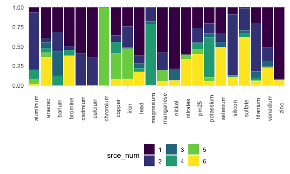

APCA 6 - remove 7/2 - 7/6
================
Rachel Tao
1/23/2021

## Loadings

| element   | MeanConc | source\_1 | source\_2 | source\_3 | source\_4 | source\_5 | source\_6 | r\_squared | PredConc | Pct\_error |
| :-------- | -------: | --------: | --------: | --------: | --------: | --------: | --------: | ---------: | -------: | ---------: |
| aluminum  |    20.91 |      1.82 |     19.90 |    \-1.42 |      3.15 |      1.79 |      0.46 |       0.65 |    25.70 |      22.93 |
| arsenic   |     0.66 |      0.21 |      0.03 |      0.04 |      0.03 |      0.03 |      0.20 |       0.33 |     0.54 |    \-17.75 |
| barium    |     6.23 |      1.78 |      1.41 |      1.76 |      0.69 |    \-0.79 |    \-0.02 |       0.56 |     4.83 |    \-22.43 |
| bromine   |     3.31 |      1.37 |      0.15 |    \-0.06 |      0.20 |    \-0.04 |      1.05 |       0.58 |     2.67 |    \-19.38 |
| cadmium   |     1.51 |      0.11 |      0.08 |    \-0.06 |    \-0.01 |    \-0.06 |    \-0.04 |       0.01 |     0.01 |    \-99.34 |
| calcium   |    56.07 |     33.94 |     18.57 |    \-0.89 |      0.32 |    \-2.27 |    \-1.29 |       0.73 |    48.38 |    \-13.72 |
| chromium  |     1.63 |    \-0.27 |    \-0.22 |      0.01 |    \-0.09 |      3.00 |    \-0.18 |       0.19 |     2.25 |      38.24 |
| copper    |     4.48 |      1.82 |      0.44 |    \-0.05 |      0.73 |      1.69 |      0.39 |       0.71 |     5.02 |      11.98 |
| iron      |   111.84 |     26.60 |     29.39 |      1.20 |    \-0.12 |     42.00 |      9.42 |       0.98 |   108.49 |     \-3.00 |
| lead      |     3.29 |      2.59 |      0.43 |      0.29 |      0.19 |    \-0.29 |      0.73 |       0.63 |     3.94 |      19.64 |
| magnesium |     7.68 |    \-0.80 |      0.66 |      0.11 |      2.85 |    \-0.65 |      0.03 |       0.22 |     2.21 |    \-71.23 |
| manganese |     2.37 |      1.68 |      0.64 |    \-0.01 |      0.01 |      0.38 |      0.17 |       0.68 |     2.88 |      21.36 |
| nickel    |     8.59 |      7.10 |      0.10 |      1.22 |    \-0.72 |    \-0.60 |      0.59 |       0.81 |     7.69 |    \-10.48 |
| nitrates  |  1811.74 |   1201.01 |   \-97.98 |   \-24.86 |    \-9.57 |    109.62 |    669.73 |       0.64 |  1847.95 |       2.00 |
| pm25      | 11855.45 |   2568.00 |   1769.54 |     85.85 |    696.64 |    625.44 |   3875.67 |       0.78 |  9621.14 |    \-18.85 |
| potassium |    47.91 |     10.23 |      6.58 |      2.31 |     25.53 |      2.72 |      2.51 |       0.92 |    49.87 |       4.08 |
| selenium  |     0.76 |      0.33 |      0.12 |      0.07 |    \-0.01 |    \-0.07 |      0.50 |       0.77 |     0.94 |      24.47 |
| silicon   |    72.07 |      6.64 |     59.65 |    \-0.12 |      1.45 |    \-7.59 |      8.45 |       0.92 |    68.48 |     \-4.98 |
| sulfate   |  3008.63 |     31.02 |    716.84 |     70.92 |    135.24 |   \-25.90 |   1549.36 |       0.75 |  2477.48 |    \-17.65 |
| titanium  |     3.44 |      0.69 |      2.17 |      0.29 |      0.13 |      0.04 |      0.18 |       0.73 |     3.50 |       1.61 |
| vanadium  |     4.45 |      2.80 |      0.97 |      0.35 |      0.00 |      0.07 |      1.22 |       0.70 |     5.41 |      21.60 |
| zinc      |    26.88 |     24.52 |    \-0.49 |    \-0.91 |      0.65 |    \-0.94 |      1.70 |       0.84 |    24.52 |     \-8.76 |

## Source proportions

| element   | source\_1 | source\_2 | source\_3 | source\_4 | source\_5 | source\_6 |
| :-------- | --------: | --------: | --------: | --------: | --------: | --------: |
| aluminum  |      6.70 |     73.39 |      0.00 |     11.62 |      6.61 |      1.69 |
| arsenic   |     39.51 |      5.63 |      6.91 |      6.07 |      5.71 |     36.16 |
| barium    |     31.59 |     25.05 |     31.11 |     12.24 |      0.00 |      0.00 |
| bromine   |     49.32 |      5.58 |      0.00 |      7.22 |      0.00 |     37.88 |
| cadmium   |     58.85 |     41.15 |      0.00 |      0.00 |      0.00 |      0.00 |
| calcium   |     64.25 |     35.15 |      0.00 |      0.60 |      0.00 |      0.00 |
| chromium  |      0.00 |      0.00 |      0.48 |      0.00 |     99.52 |      0.00 |
| copper    |     35.97 |      8.63 |      0.00 |     14.36 |     33.41 |      7.63 |
| iron      |     24.49 |     27.06 |      1.10 |      0.00 |     38.67 |      8.67 |
| lead      |     61.35 |     10.10 |      6.83 |      4.55 |      0.00 |     17.17 |
| magnesium |      0.00 |     18.10 |      3.04 |     77.95 |      0.00 |      0.92 |
| manganese |     58.16 |     22.37 |      0.00 |      0.29 |     13.20 |      5.99 |
| nickel    |     78.82 |      1.15 |     13.49 |      0.00 |      0.00 |      6.54 |
| nitrates  |     60.65 |      0.00 |      0.00 |      0.00 |      5.54 |     33.82 |
| pm25      |     26.69 |     18.39 |      0.89 |      7.24 |      6.50 |     40.28 |
| potassium |     20.50 |     13.20 |      4.64 |     51.19 |      5.45 |      5.03 |
| selenium  |     32.76 |     11.86 |      6.36 |      0.00 |      0.00 |     49.01 |
| silicon   |      8.71 |     78.29 |      0.00 |      1.91 |      0.00 |     11.09 |
| sulfate   |      1.24 |     28.63 |      2.83 |      5.40 |      0.00 |     61.89 |
| titanium  |     19.76 |     62.00 |      8.31 |      3.58 |      1.24 |      5.11 |
| vanadium  |     51.73 |     17.84 |      6.50 |      0.08 |      1.33 |     22.53 |
| zinc      |     91.26 |      0.00 |      0.00 |      2.40 |      0.00 |      6.33 |

## Bar graph of the above proportions

