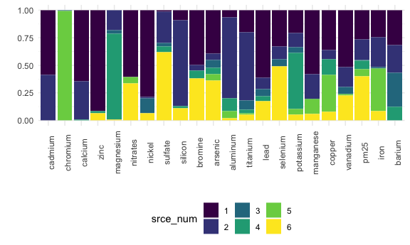

APCA NYC
================
Rachel Tao
1/23/2021

Load in data

    ## 
    ## ── Column specification ────────────────────────────────────────────────────────
    ## cols(
    ##   .default = col_double(),
    ##   date_local = col_date(format = "")
    ## )
    ## ℹ Use `spec()` for the full column specifications.

    ## Warning: Missing column names filled in: 'X1' [1]

    ## 
    ## ── Column specification ────────────────────────────────────────────────────────
    ## cols(
    ##   .default = col_double(),
    ##   date_local = col_date(format = "")
    ## )
    ## ℹ Use `spec()` for the full column specifications.

Means, correlations and variances

``` r
conc_corr <- 
  conc %>% 
  select(-date)

corr <- 
  summarize(conc_corr, corr = cor(conc_corr, use = "pairwise.complete.obs"))

conc_summarize <- 
  conc_corr %>% 
  pivot_longer(everything(),
               names_to = "element",
               values_to = "concentration") %>% 
  group_by(element)

means <- conc_summarize %>% 
  summarize(mean = mean(concentration, na.rm = TRUE)) %>% 
  arrange(element)
```

    ## `summarise()` ungrouping output (override with `.groups` argument)

``` r
vars <- conc_summarize %>% 
  summarize(variance = var(concentration, na.rm = TRUE)) %>% 
  arrange(element)
```

    ## `summarise()` ungrouping output (override with `.groups` argument)

Scaled factor analysis - must provide number of factors here

``` r
# set mean = 0, SD = 1
zspec_pm25 <- 
  conc %>% 
  select(-date, -pm25, -sulfur) %>% 
  scale(center = TRUE, scale = TRUE)

# factor analysis - must provide number of factors!
factors <- 
  fa(zspec_pm25,
     nfactors = 6, max.iter = 500,
     rotate = "varimax",
     scores = "regression",
     SMC  = TRUE,
     fm = "pa")

# calculate factor scores, loadings, and weights (aka standardized scoring coefficients)
fact <- as_tibble(factors$scores)
loadings <- factors$loadings
factor_stat <- factors$weights %>% 
  as_tibble(rownames = NA) %>% 
  rownames_to_column("element") %>% 
  arrange(element)
```

calculate absolute factor scores for each day (Equations 5-7 in
statistical methods of Kavouras 2001)

``` r
# join standardized scoring coefficients with means and variances
coeff <- left_join(means, vars, by = "element") %>% 
  left_join(factor_stat, by = "element")

# calculate minimum values to find absolute factor scores (equations 5 and 6)
min <- coeff %>% 
  pivot_longer(contains("PA"),
               names_to = "factor_num",
               names_prefix = "PA",
               values_to = "factor_coeff") %>% 
  mutate(minimum = factor_coeff*(-mean/(variance^(1/2)))) %>% 
  select(element, factor_num, minimum) %>% 
  group_by(factor_num) %>% 
  summarize(sum = sum(minimum, na.rm = TRUE)) %>% 
  pivot_wider(factor_num:sum,
              names_from = factor_num,
              names_prefix = "minimum_",
              values_from = sum)
```

    ## `summarise()` ungrouping output (override with `.groups` argument)

``` r
# reattach factor scores to dates and calculate absolute factor scores for each day
# (equation 7)
a <- conc %>% 
  select(date) %>% 
  cbind(fact) %>% 
  pivot_longer(contains("PA"),
               names_to = "factor_num",
               names_prefix = "PA",
               values_to = "factor_score") %>% 
  mutate(factor_num = as.numeric(factor_num)) %>% 
  cbind(min) %>% 
  pivot_longer(contains("minimum"),
               names_to = "min_num",
               names_prefix = "minimum_",
               values_to = "minimum") %>% 
  mutate(min_num = as.numeric(min_num)) %>% 
  filter(factor_num == min_num) %>% 
  mutate(factor_score = factor_score - minimum) %>% 
  select(-min_num, -minimum)
```

factor means

``` r
# this is a check - not necessary for next steps
factor_means <- a %>% 
  select(factor_num, factor_score) %>% 
  group_by(factor_num) %>% 
  summarize(mean_score = mean(factor_score, na.rm = TRUE))
```

    ## `summarise()` ungrouping output (override with `.groups` argument)

Regress each element on factors to see source contribution

``` r
# define 'regress' as regression function with y as dependent variable and x as independent variable(s)
# return tidy output for beta values and r-squared value
regress = function(y) {
  
  z = lm(y ~ x)
  
  r.squared = broom::glance(z) %>% select(r.squared)

  betas = broom::tidy(z) %>% pivot_wider(term:estimate,
                                         names_from = "term",
                                         values_from = "estimate")
  
  return(cbind(r.squared, betas))
  
}

# independent variables for regression will be factors from factor analysis. define these as 'x'
x <- a %>% 
  pivot_wider(everything(),
              names_from = factor_num,
              names_prefix = "factor_",
              values_from = factor_score) %>% 
  select(contains("factor")) %>% as.matrix()

# dependent variable for regression will be actual element concentration. define this as y.
y <- conc %>% select(-date, -sulfur)

# repeat 'regress' for each element using 'x' as factors and 'y' as concentrations)
regress <- map(y, regress) %>% 
  enframe(name = "element") %>% 
  unnest(c(value)) %>% 
  janitor::clean_names() %>% 
  rename_at(vars(contains("factor")), funs(str_replace(., "xfactor", "beta")))
```

    ## Warning: `funs()` is deprecated as of dplyr 0.8.0.
    ## Please use a list of either functions or lambdas: 
    ## 
    ##   # Simple named list: 
    ##   list(mean = mean, median = median)
    ## 
    ##   # Auto named with `tibble::lst()`: 
    ##   tibble::lst(mean, median)
    ## 
    ##   # Using lambdas
    ##   list(~ mean(., trim = .2), ~ median(., na.rm = TRUE))
    ## This warning is displayed once every 8 hours.
    ## Call `lifecycle::last_warnings()` to see where this warning was generated.

``` r
# dataset storing r-squred values
r <- regress %>% 
  select(element, r_squared)

# dataset storing beta values
betas <- regress %>% 
  select(element, starts_with("beta")) %>% 
  nest(betas = starts_with("beta"))
```

calculate source contributions

``` r
# combine betas with factor scores in a list 
sources = lapply(betas$betas, cbind, a)

# in the above step, element names are automatically removed. rename list elements
names(sources) <- betas$element

# calculate source contributions by multiplying absolute factor scores by beta values
sources <- lapply(sources, as_tibble) %>% 
  bind_rows(.id = "element") %>%
  pivot_longer(starts_with("beta"),
               names_to = "beta_num",
               names_prefix = "beta_",
               values_to = "beta_value") %>% 
  mutate(
    beta_num = as.numeric(beta_num)
  ) %>% 
  filter(factor_num == beta_num) %>% 
  mutate(
    srce = factor_score*beta_value
  ) %>% 
  mutate(srce_num = as.character(beta_num)) %>% 
  select(element, date, srce_num, srce) 

conc_long <- conc %>% 
  pivot_longer(!date,
               names_to = "element",
               values_to = "concentration") %>% 
  arrange(element)

source_conc <- left_join(sources, conc_long, by = c('element', 'date'))

# calculate mean source contributions for each element (is this equivalent to laodings?)
mean_source <- source_conc %>% 
  group_by(element, srce_num) %>% 
  summarize(source_mean = mean(srce, na.rm = TRUE),
            MeanConc = mean(concentration, na.rm = TRUE)) %>% 
  pivot_wider(names_from = "srce_num",
              names_prefix = "source_",
              values_from = "source_mean")
```

    ## `summarise()` regrouping output by 'element' (override with `.groups` argument)

### Source contributions to each component of PM2.5

``` r
# calculate mean predicted concentration and percent error
SA_Varimax <- mean_source %>% 
  ungroup(element) %>% 
  left_join(r, by = "element") %>% 
  mutate(
    PredConc = reduce(select(., contains("source")), `+`),
    Pct_error = (PredConc - MeanConc)/MeanConc
  )

# calculate proportion of each element coming from each source 
# (negative values from SA_Varimax converted to 0%)
SA_proportion_long <- source_conc %>% 
  group_by(element, srce_num) %>% 
  summarize(source_mean = mean(srce, na.rm = TRUE),
            MeanConc = mean(concentration, na.rm = TRUE)) %>% 
  mutate(
    source_mean = if_else(source_mean < 0, 0, source_mean)) %>% 
  ungroup() %>% 
  group_by(element) %>% 
  mutate(
    total = sum(source_mean),
    source_percent = round((source_mean/total)*100, digits = 2))
```

    ## `summarise()` regrouping output by 'element' (override with `.groups` argument)

``` r
# make the table nicer to look at
SA_proportion <- SA_proportion_long %>% 
  relocate(element, srce_num, source_percent) %>% 
  pivot_wider(element: source_percent,
              names_from = srce_num,
              names_prefix = "source_",
              values_from = source_percent) %>% 
  kable()

SA_proportion
```

| element   | source\_1 | source\_2 | source\_3 | source\_4 | source\_5 | source\_6 |
| :-------- | --------: | --------: | --------: | --------: | --------: | --------: |
| aluminum  |      0.00 |     76.41 |      0.00 |     11.82 |      7.10 |      4.67 |
| arsenic   |     50.97 |      6.08 |      7.44 |     27.50 |      5.81 |      2.20 |
| barium    |      7.56 |     11.89 |     43.29 |     24.37 |      0.00 |     12.90 |
| bromine   |     44.84 |      4.00 |      0.00 |     44.25 |      0.00 |      6.91 |
| cadmium   |      0.00 |     35.11 |      0.00 |     64.89 |      0.00 |      0.00 |
| calcium   |      3.29 |     35.79 |      0.00 |     60.92 |      0.00 |      0.00 |
| chromium  |      0.00 |      0.00 |      0.00 |      0.00 |    100.00 |      0.00 |
| copper    |     11.51 |      9.03 |      1.15 |     41.82 |     27.63 |      8.86 |
| iron      |     12.33 |     26.82 |      1.81 |     23.94 |     33.78 |      1.33 |
| lead      |     30.36 |      8.95 |      8.11 |     51.07 |      0.00 |      1.52 |
| magnesium |      2.01 |     22.32 |     14.85 |     12.19 |      0.00 |     48.63 |
| manganese |     13.69 |     23.16 |      0.00 |     50.92 |     12.23 |      0.00 |
| nickel    |     27.97 |      5.73 |     12.76 |     53.53 |      0.01 |      0.00 |
| nitrates  |     45.04 |      0.00 |      0.00 |     48.75 |      6.20 |      0.00 |
| pm25      |     52.47 |     19.70 |      0.08 |     18.56 |      5.23 |      3.96 |
| selenium  |     68.30 |     12.92 |      4.80 |     13.98 |      0.00 |      0.00 |
| silicon   |     12.37 |     78.64 |      0.48 |      6.83 |      0.00 |      1.67 |
| sulfate   |     67.67 |     25.69 |      1.21 |      0.00 |      0.00 |      5.42 |
| titanium  |     14.77 |     60.91 |      9.14 |     14.42 |      0.10 |      0.66 |
| vanadium  |     37.87 |     19.42 |      4.94 |     35.24 |      2.53 |      0.00 |
| zinc      |     11.11 |      0.00 |      0.00 |     86.51 |      0.00 |      2.38 |

``` r
# bar graph showing proportion of each element coming from each source
SA_bar <- SA_proportion_long %>% 
  ungroup() %>% 
  mutate(element = fct_reorder(element, source_percent)) %>% 
  ggplot(aes(x = element, y = source_mean, fill = srce_num)) +
  geom_col(position = "fill") +
  theme(axis.text.x = element_text(angle = 90)) +
  ylab("") +
  xlab("")

SA_bar
```



``` r
# source contributions to total pm2.5
pm25 <- source_conc %>% 
  filter(element == 'pm25') %>% 
  select(-element) %>% 
  pivot_wider(names_from = srce_num,
              names_prefix = "source_",
              values_from = srce)
```

### Next steps:

  - APCA, PCP, PCP + APCA?
  - when running APCA for NYC, extract loadings and for each source
    contribution look at seasonal patterns (break calendar into 4
    seasons of 3 months each), look at concentrations/contributions by
    season (traffic higher in winter, regional in winter), day of week
    (traffic higher on weekdays)
  - scores: correlations between sources and PM2.5 + patterns
