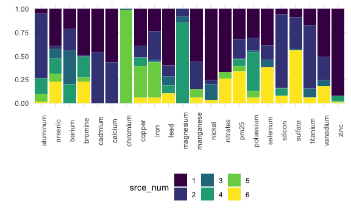

APCA NYC
================
Rachel Tao
1/23/2021

### Source contributions to each component of PM2.5

| element   |  MeanConc | source\_1 | source\_2 | source\_3 | source\_4 | source\_5 | source\_6 | r\_squared | PredConc | Pct\_error |
| :-------- | --------: | --------: | --------: | --------: | --------: | --------: | --------: | ---------: | -------: | ---------: |
| aluminum  |    20.366 |     1.505 |    18.815 |   \-1.684 |     4.689 |     2.318 |     0.339 |      0.624 |   25.983 |      27.58 |
| arsenic   |     0.654 |     0.239 |     0.020 |     0.059 |     0.099 |     0.053 |     0.136 |      0.361 |    0.605 |     \-7.43 |
| barium    |     6.102 |     1.429 |     1.553 |     2.349 |     1.331 |   \-0.631 |   \-0.382 |      0.619 |    5.650 |     \-7.40 |
| bromine   |     3.320 |     1.500 |     0.033 |     0.035 |     0.663 |     0.144 |     0.685 |      0.633 |    3.060 |     \-7.83 |
| cadmium   |     1.511 |     0.093 |     0.109 |   \-0.077 |   \-0.014 |   \-0.068 |   \-0.034 |      0.012 |    0.008 |    \-99.44 |
| calcium   |    56.174 |    32.437 |    24.595 |   \-1.760 |   \-1.870 |   \-5.111 |   \-1.281 |      0.793 |   47.010 |    \-16.31 |
| chromium  |     1.634 |   \-0.231 |   \-0.353 |     0.032 |   \-0.079 |     3.051 |   \-0.164 |      0.201 |    2.257 |      38.10 |
| copper    |     4.407 |     1.956 |     0.618 |   \-0.108 |     0.432 |     1.655 |     0.301 |      0.635 |    4.855 |      10.17 |
| iron      |   111.766 |    26.010 |    33.601 |     1.935 |     0.539 |    41.167 |     6.733 |      0.987 |  109.986 |     \-1.59 |
| lead      |     3.282 |     2.611 |     0.495 |     0.411 |     0.366 |   \-0.203 |     0.450 |      0.650 |    4.130 |      25.87 |
| magnesium |     7.476 |   \-0.788 |     0.464 |     0.365 |     4.734 |   \-0.190 |   \-0.532 |      0.295 |    4.054 |    \-45.77 |
| manganese |     2.375 |     1.665 |     0.859 |   \-0.052 |   \-0.214 |     0.267 |     0.167 |      0.727 |    2.693 |      13.39 |
| nickel    |     8.651 |     6.860 |     0.394 |     1.550 |   \-0.857 |   \-0.728 |     0.306 |      0.806 |    7.525 |    \-13.01 |
| nitrates  |  1822.267 |  1310.063 | \-113.823 |   \-8.384 |   \-1.727 |   139.007 |   500.506 |      0.633 | 1825.641 |       0.19 |
| pm25      | 11803.265 |  3092.121 |  1961.000 |    66.333 |   670.757 |   569.402 |  3236.791 |      0.804 | 9596.405 |    \-18.70 |
| potassium |    44.313 |    14.096 |     5.794 |     1.071 |    18.475 |     3.192 |     2.658 |      0.676 |   45.286 |       2.19 |
| selenium  |     0.756 |     0.400 |     0.158 |     0.084 |   \-0.023 |   \-0.084 |     0.394 |      0.754 |    0.930 |      23.02 |
| silicon   |    71.426 |     4.592 |    60.483 |     0.706 |     5.715 |   \-6.924 |     6.272 |      0.870 |   70.844 |     \-0.81 |
| sulfate   |  2980.023 |   225.974 |   818.858 |    29.608 |  \-78.766 | \-115.361 |  1382.689 |      0.827 | 2263.002 |    \-24.06 |
| titanium  |     3.394 |     0.596 |     2.303 |     0.311 |     0.028 |   \-0.055 |     0.201 |      0.704 |    3.384 |     \-0.30 |
| vanadium  |     4.446 |     2.856 |     1.360 |     0.381 |   \-0.217 |   \-0.118 |     1.015 |      0.710 |    5.277 |      18.67 |
| zinc      |    27.030 |    24.257 |   \-0.453 |   \-0.604 |     1.637 |     0.243 |     0.232 |      0.822 |   25.311 |     \-6.36 |

### Proportion of each element coming from each source

| element   | source\_1 | source\_2 | source\_3 | source\_4 | source\_5 | source\_6 |
| :-------- | --------: | --------: | --------: | --------: | --------: | --------: |
| aluminum  |      5.44 |     68.01 |      0.00 |     16.95 |      8.38 |      1.22 |
| arsenic   |     39.44 |      3.23 |      9.72 |     16.32 |      8.81 |     22.49 |
| barium    |     21.45 |     23.32 |     35.26 |     19.98 |      0.00 |      0.00 |
| bromine   |     49.01 |      1.07 |      1.16 |     21.67 |      4.70 |     22.39 |
| cadmium   |     46.06 |     53.94 |      0.00 |      0.00 |      0.00 |      0.00 |
| calcium   |     56.88 |     43.12 |      0.00 |      0.00 |      0.00 |      0.00 |
| chromium  |      0.00 |      0.00 |      1.05 |      0.00 |     98.95 |      0.00 |
| copper    |     39.42 |     12.46 |      0.00 |      8.71 |     33.35 |      6.06 |
| iron      |     23.65 |     30.55 |      1.76 |      0.49 |     37.43 |      6.12 |
| lead      |     60.25 |     11.43 |      9.49 |      8.45 |      0.00 |     10.38 |
| magnesium |      0.00 |      8.35 |      6.57 |     85.09 |      0.00 |      0.00 |
| manganese |     56.28 |     29.03 |      0.00 |      0.00 |      9.04 |      5.66 |
| nickel    |     75.30 |      4.33 |     17.01 |      0.00 |      0.00 |      3.36 |
| nitrates  |     67.20 |      0.00 |      0.00 |      0.00 |      7.13 |     25.67 |
| pm25      |     32.22 |     20.43 |      0.69 |      6.99 |      5.93 |     33.73 |
| potassium |     31.13 |     12.79 |      2.37 |     40.80 |      7.05 |      5.87 |
| selenium  |     38.62 |     15.22 |      8.10 |      0.00 |      0.00 |     38.07 |
| silicon   |      5.91 |     77.77 |      0.91 |      7.35 |      0.00 |      8.07 |
| sulfate   |      9.20 |     33.33 |      1.21 |      0.00 |      0.00 |     56.27 |
| titanium  |     17.32 |     66.96 |      9.05 |      0.81 |      0.00 |      5.86 |
| vanadium  |     50.89 |     24.23 |      6.78 |      0.00 |      0.00 |     18.09 |
| zinc      |     91.99 |      0.00 |      0.00 |      6.21 |      0.92 |      0.88 |

### Bar graph of above proportions

