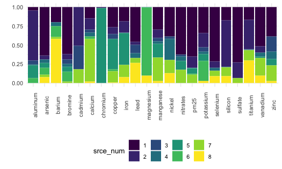

APCA 8 - remove 7/2 - 7/6
================
Rachel Tao
1/23/2021

## Loadings

| element   | MeanConc | source\_1 | source\_2 | source\_3 | source\_4 | source\_5 | source\_6 | source\_7 | source\_8 | r\_squared | PredConc | Pct\_error |
| :-------- | -------: | --------: | --------: | --------: | --------: | --------: | --------: | --------: | --------: | ---------: | -------: | ---------: |
| aluminum  |    20.37 |      1.36 |     18.60 |      1.44 |      0.39 |      4.81 |      1.83 |    \-0.42 |    \-3.72 |       0.89 |    24.29 |      19.26 |
| arsenic   |     0.65 |      0.38 |      0.03 |      0.00 |      0.03 |      0.04 |      0.05 |      0.02 |      0.05 |       0.34 |     0.59 |     \-9.80 |
| barium    |     6.10 |      1.58 |    \-0.22 |    \-0.06 |      0.38 |    \-1.69 |      1.09 |      0.24 |      4.52 |       0.56 |     5.85 |     \-4.13 |
| bromine   |     3.32 |      1.82 |      0.22 |      0.16 |      0.12 |      0.19 |      0.38 |      0.06 |    \-0.03 |       0.62 |     2.93 |    \-11.74 |
| cadmium   |     1.51 |    \-0.09 |      0.10 |      0.06 |      0.00 |    \-0.03 |    \-0.07 |      0.03 |    \-0.05 |       0.01 |   \-0.06 |   \-103.97 |
| calcium   |    56.17 |      8.37 |      8.74 |      2.11 |      2.94 |    \-1.91 |      1.88 |     32.20 |      1.04 |       0.99 |    55.38 |     \-1.41 |
| chromium  |     1.63 |    \-0.15 |      0.04 |    \-0.06 |    \-0.07 |      3.24 |    \-0.03 |    \-0.20 |    \-0.57 |       0.21 |     2.20 |      34.63 |
| copper    |     4.41 |      1.23 |      0.39 |      0.31 |    \-0.01 |      1.83 |      0.12 |      0.68 |      0.03 |       0.61 |     4.58 |       3.93 |
| iron      |   111.77 |     20.90 |     16.72 |      0.97 |    \-1.84 |     46.36 |    \-0.05 |     18.22 |      8.90 |       0.99 |   110.18 |     \-1.42 |
| lead      |     3.28 |      1.93 |      0.18 |      0.44 |      0.29 |    \-0.35 |    \-0.04 |      0.27 |      1.13 |       0.78 |     3.84 |      17.02 |
| magnesium |     7.48 |    \-0.02 |    \-0.19 |    \-0.39 |    \-0.01 |      0.07 |      7.77 |    \-0.13 |      0.84 |       0.84 |     7.93 |       6.08 |
| manganese |     2.37 |      0.86 |      0.31 |      0.14 |      0.10 |      0.52 |    \-0.12 |      0.90 |      0.08 |       0.65 |     2.80 |      17.91 |
| nickel    |     8.65 |      4.11 |    \-0.31 |      0.29 |      2.95 |    \-0.20 |    \-0.39 |      1.85 |      1.39 |       0.94 |     9.70 |      12.13 |
| nitrates  |  1822.27 |   1347.74 |   \-85.62 |     50.57 |    118.38 |    256.38 |   \-22.35 |    374.44 |  \-173.17 |       0.65 |  1866.38 |       2.42 |
| pm25      | 11803.26 |   6286.55 |   1471.99 |  \-293.13 |     47.33 |    674.05 |    152.95 |   1067.63 |   \-86.42 |       0.79 |  9320.95 |    \-21.03 |
| potassium |    44.31 |     14.42 |      7.63 |      2.56 |      1.29 |      3.76 |     11.10 |      0.05 |      1.15 |       0.49 |    41.97 |     \-5.29 |
| selenium  |     0.76 |      0.81 |      0.10 |    \-0.04 |      0.04 |    \-0.12 |    \-0.05 |      0.08 |      0.10 |       0.75 |     0.91 |      20.41 |
| silicon   |    71.43 |     12.21 |     42.55 |    \-0.03 |      0.72 |    \-3.47 |    \-0.11 |      7.69 |      6.53 |       0.84 |    66.10 |     \-7.46 |
| sulfate   |  2980.02 |   2117.38 |    582.43 |  \-302.87 |   \-64.47 |  \-188.09 |  \-104.06 |    187.79 |      7.38 |       0.76 |  2235.49 |    \-24.98 |
| titanium  |     3.39 |      0.59 |      1.34 |      0.03 |      0.03 |    \-0.10 |    \-0.18 |      0.47 |      1.04 |       0.78 |     3.22 |     \-5.14 |
| vanadium  |     4.45 |      2.96 |      0.46 |    \-0.06 |      0.32 |      0.11 |    \-0.02 |      1.30 |      0.57 |       0.69 |     5.64 |      26.85 |
| zinc      |    27.03 |      9.82 |    \-0.70 |      5.02 |      2.48 |      2.10 |    \-0.55 |      5.24 |      0.64 |       0.92 |    24.06 |    \-10.99 |

## Source proportions

| element   | source\_1 | source\_2 | source\_3 | source\_4 | source\_5 | source\_6 | source\_7 | source\_8 |
| :-------- | --------: | --------: | --------: | --------: | --------: | --------: | --------: | --------: |
| aluminum  |      4.79 |     65.43 |      5.06 |      1.38 |     16.92 |      6.44 |      0.00 |      0.00 |
| arsenic   |     63.61 |      5.06 |      0.00 |      4.82 |      6.33 |      8.83 |      3.48 |      7.87 |
| barium    |     20.28 |      0.00 |      0.00 |      4.82 |      0.00 |     13.97 |      3.05 |     57.88 |
| bromine   |     61.58 |      7.57 |      5.49 |      4.22 |      6.43 |     12.78 |      1.92 |      0.00 |
| cadmium   |      0.00 |     51.21 |     30.92 |      0.00 |      0.00 |      0.00 |     17.87 |      0.00 |
| calcium   |     14.60 |     15.26 |      3.69 |      5.13 |      0.00 |      3.28 |     56.21 |      1.82 |
| chromium  |      0.00 |      1.22 |      0.00 |      0.00 |     98.78 |      0.00 |      0.00 |      0.00 |
| copper    |     26.72 |      8.42 |      6.85 |      0.00 |     39.79 |      2.72 |     14.78 |      0.71 |
| iron      |     18.65 |     14.92 |      0.87 |      0.00 |     41.37 |      0.00 |     16.26 |      7.94 |
| lead      |     45.62 |      4.30 |     10.39 |      6.74 |      0.00 |      0.00 |      6.41 |     26.54 |
| magnesium |      0.00 |      0.00 |      0.00 |      0.00 |      0.79 |     89.55 |      0.00 |      9.66 |
| manganese |     29.61 |     10.75 |      4.80 |      3.44 |     17.71 |      0.00 |     31.04 |      2.64 |
| nickel    |     38.82 |      0.00 |      2.74 |     27.83 |      0.00 |      0.00 |     17.46 |     13.14 |
| nitrates  |     62.76 |      0.00 |      2.35 |      5.51 |     11.94 |      0.00 |     17.44 |      0.00 |
| pm25      |     64.81 |     15.17 |      0.00 |      0.49 |      6.95 |      1.58 |     11.01 |      0.00 |
| potassium |     34.35 |     18.18 |      6.11 |      3.08 |      8.97 |     26.46 |      0.11 |      2.74 |
| selenium  |     71.59 |      8.66 |      0.00 |      3.46 |      0.00 |      0.00 |      7.21 |      9.08 |
| silicon   |     17.52 |     61.04 |      0.00 |      1.03 |      0.00 |      0.00 |     11.03 |      9.37 |
| sulfate   |     73.14 |     20.12 |      0.00 |      0.00 |      0.00 |      0.00 |      6.49 |      0.25 |
| titanium  |     16.93 |     38.26 |      0.84 |      0.94 |      0.00 |      0.00 |     13.39 |     29.64 |
| vanadium  |     51.70 |      8.13 |      0.00 |      5.57 |      1.89 |      0.00 |     22.79 |      9.92 |
| zinc      |     38.82 |      0.00 |     19.82 |      9.81 |      8.31 |      0.00 |     20.69 |      2.54 |

## Bar graph of the above proportions

