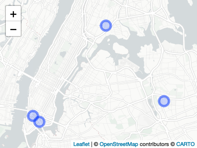
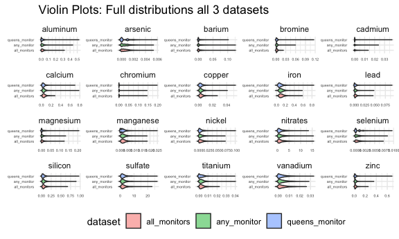
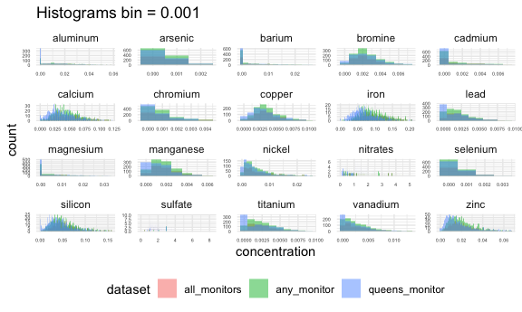
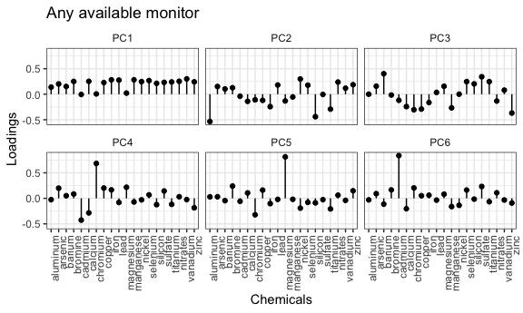

Explore AQS monitor datasets
================
Rachel Tao

### Map of monitor locations

We are looking at 3 different datasets:

1)  Queens monitor (also called monitor 124): This dataset includes a
    single monitor, the one at Queens College (see map above).
2)  All monitors: This dataset only includes days where all monitors are
    available, and takes the average of all 3
3)  Any monitor: This dataset takes the average of all monitors
    available on that day, no matter how many are available. This means
    that some days the value is an average of all 3 monitors, and some
    days it is the raw value for a single monitor.

### Data availability over time at each monitor

The ‘all monitors’ dataset starts later than the other two datasets
(around 2003) and also includes a gap of about 2-3 years from 2011-2014.
The queens monitor and ‘any monitor’ dataset have full data 2001
onwards. For analyses, we should use the ‘any monitors’ dataset or the
queens dataset so that we have data for the entire period of interest.

### Distribution

##### NOTES (potential measurement error):

  - arsenic and selenium are not well-measured by the instrument
  - sodium and sulfate are highly correlated because they have similar
    frequencies

As a first pass, we can look at the distributions of each dataset
side-by-side for each chemical:

Now, let’s try an overlaid density plot to get a better sense of the
distributions:

The full distributions for many chemicals have long right tails, so it
might be easier to visualize if we just take the bottom 95th%ile:

It looks like the Queens monitor is the only one that has a slightly
different distribution across pollutants. Let’s compare just the ‘any’
and ‘all’ datasets to see if their distributions match up when we remove
the queens monitor’s distribution:

Some of the density plots (especially for the low-concentration
pollutants at the queens monitor) have ‘bumpy’ distributions. Is this a
true signal or is it because the unit of measurement is 0.0001?

Although these histograms make it difficult to see the distributions for
higher-concentration pollutants, we can see that the pollutants with
lower concentrations no longer have the ‘bumpy’ distributions. Using a
smaller bin size, we see similar patterns as in the density plot:

Based on the density plots, the ‘any monitor available’ and the ‘all
monitors’ datasets appear to have similar distributions for all
chemicals. The queens monitor has a slightly different distribution.
Since the queens monitor has data availability for the entire study
period, and the ‘any monitor’ dataset has variable numbers of
observations per date, so we can use the ‘any monitor’ dataset for
analyses and do a sensitivity analysis using the queens monitor dataset.

### Correlation Matrix

Correlations range from -0.1 to 0.7.

### Principal Components Analysis

| Component | PCA\_any | PCA\_all | PCA\_124 |
| --------: | -------: | -------: | -------: |
|         1 |  35.4789 |  38.7839 |  32.4709 |
|         2 |   9.8944 |   9.8258 |   8.5485 |
|         3 |   7.4585 |   7.0660 |   7.4785 |
|         4 |   5.5362 |   5.5295 |   5.8968 |
|         5 |   5.3023 |   5.3064 |   5.2608 |
|         6 |   4.9079 |   5.1109 |   5.0224 |
|         7 |   4.6035 |   4.7310 |   4.7076 |
|         8 |   3.5436 |   3.3772 |   4.4343 |
|         9 |   3.4844 |   3.2771 |   4.0378 |
|        10 |   3.1811 |   2.7232 |   3.3867 |
|        11 |   2.5340 |   2.3665 |   2.7550 |
|        12 |   2.2020 |   2.2429 |   2.6578 |
|        13 |   2.0519 |   1.9412 |   2.3841 |
|        14 |   1.9714 |   1.5346 |   2.2065 |
|        15 |   1.9182 |   1.5025 |   2.0763 |
|        16 |   1.6861 |   1.3150 |   1.9266 |
|        17 |   1.4058 |   1.2262 |   1.7192 |
|        18 |   1.1684 |   0.9097 |   1.1812 |
|        19 |   0.9302 |   0.6898 |   1.0010 |
|        20 |   0.7409 |   0.5407 |   0.8480 |

The proportion of variation for each component is similar across
datasets. This suggests that it is likely reasonable to assume that when
use other dimensionality reduction techniques with the ‘any monitor’
dataset, the results would be similar if we used the ‘all monitors’
dataset or the queens dataset. The loadings are also similar across
datasets.

### Loadings

Most chemicals load on the first component for all 3 datasets.
