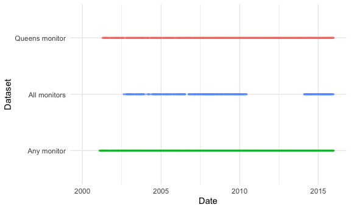

Explore AQS monitor datasets
================
Rachel Tao

PCA any

    ## Importance of components:
    ##                           PC1     PC2     PC3     PC4     PC5     PC6     PC7
    ## Standard deviation     2.6638 1.40673 1.22135 1.05226 1.02979 0.99075 0.95953
    ## Proportion of Variance 0.3548 0.09894 0.07459 0.05536 0.05302 0.04908 0.04604
    ## Cumulative Proportion  0.3548 0.45373 0.52832 0.58368 0.63670 0.68578 0.73182
    ##                            PC8     PC9    PC10    PC11    PC12    PC13    PC14
    ## Standard deviation     0.84186 0.83480 0.79764 0.71191 0.66363 0.64060 0.62792
    ## Proportion of Variance 0.03544 0.03484 0.03181 0.02534 0.02202 0.02052 0.01971
    ## Cumulative Proportion  0.76725 0.80210 0.83391 0.85925 0.88127 0.90179 0.92150
    ##                           PC15    PC16    PC17    PC18   PC19    PC20
    ## Standard deviation     0.61939 0.58071 0.53024 0.48341 0.4313 0.38494
    ## Proportion of Variance 0.01918 0.01686 0.01406 0.01168 0.0093 0.00741
    ## Cumulative Proportion  0.94069 0.95755 0.97160 0.98329 0.9926 1.00000

PCA all

    ## Importance of components:
    ##                           PC1     PC2     PC3    PC4     PC5     PC6     PC7
    ## Standard deviation     2.7851 1.40184 1.18878 1.0516 1.03018 1.01103 0.97273
    ## Proportion of Variance 0.3878 0.09826 0.07066 0.0553 0.05306 0.05111 0.04731
    ## Cumulative Proportion  0.3878 0.48610 0.55676 0.6120 0.66512 0.71622 0.76353
    ##                            PC8     PC9    PC10    PC11    PC12    PC13    PC14
    ## Standard deviation     0.82185 0.80958 0.73800 0.68797 0.66977 0.62309 0.55400
    ## Proportion of Variance 0.03377 0.03277 0.02723 0.02367 0.02243 0.01941 0.01535
    ## Cumulative Proportion  0.79731 0.83008 0.85731 0.88097 0.90340 0.92282 0.93816
    ##                           PC15    PC16    PC17   PC18   PC19    PC20
    ## Standard deviation     0.54818 0.51283 0.49522 0.4265 0.3714 0.32884
    ## Proportion of Variance 0.01503 0.01315 0.01226 0.0091 0.0069 0.00541
    ## Cumulative Proportion  0.95319 0.96634 0.97860 0.9877 0.9946 1.00000

PCA queens

    ## Importance of components:
    ##                           PC1     PC2     PC3    PC4     PC5     PC6     PC7
    ## Standard deviation     2.7851 1.40184 1.18878 1.0516 1.03018 1.01103 0.97273
    ## Proportion of Variance 0.3878 0.09826 0.07066 0.0553 0.05306 0.05111 0.04731
    ## Cumulative Proportion  0.3878 0.48610 0.55676 0.6120 0.66512 0.71622 0.76353
    ##                            PC8     PC9    PC10    PC11    PC12    PC13    PC14
    ## Standard deviation     0.82185 0.80958 0.73800 0.68797 0.66977 0.62309 0.55400
    ## Proportion of Variance 0.03377 0.03277 0.02723 0.02367 0.02243 0.01941 0.01535
    ## Cumulative Proportion  0.79731 0.83008 0.85731 0.88097 0.90340 0.92282 0.93816
    ##                           PC15    PC16    PC17   PC18   PC19    PC20
    ## Standard deviation     0.54818 0.51283 0.49522 0.4265 0.3714 0.32884
    ## Proportion of Variance 0.01503 0.01315 0.01226 0.0091 0.0069 0.00541
    ## Cumulative Proportion  0.95319 0.96634 0.97860 0.9877 0.9946 1.00000

### Loadings

### Distribution

| Component | PCA\_any | PCA\_all | PCA\_124 |
| --------: | -------: | -------: | -------: |
|         1 |  35.4789 |  38.7839 |  32.4709 |
|         2 |   9.8944 |   9.8258 |   8.5485 |
|         3 |   7.4585 |   7.0660 |   7.4785 |
|         4 |   5.5362 |   5.5295 |   5.8968 |
|         5 |   5.3023 |   5.3064 |   5.2608 |
|         6 |   4.9079 |   5.1109 |   5.0224 |
|         7 |   4.6035 |   4.7310 |   4.7076 |
|         8 |   3.5436 |   3.3772 |   4.4343 |
|         9 |   3.4844 |   3.2771 |   4.0378 |
|        10 |   3.1811 |   2.7232 |   3.3867 |
|        11 |   2.5340 |   2.3665 |   2.7550 |
|        12 |   2.2020 |   2.2429 |   2.6578 |
|        13 |   2.0519 |   1.9412 |   2.3841 |
|        14 |   1.9714 |   1.5346 |   2.2065 |
|        15 |   1.9182 |   1.5025 |   2.0763 |
|        16 |   1.6861 |   1.3150 |   1.9266 |
|        17 |   1.4058 |   1.2262 |   1.7192 |
|        18 |   1.1684 |   0.9097 |   1.1812 |
|        19 |   0.9302 |   0.6898 |   1.0010 |
|        20 |   0.7409 |   0.5407 |   0.8480 |

geometry column in R with coordinates
