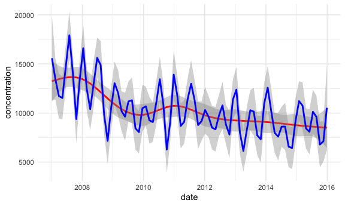

Explore APCA
================
Rachel Tao
3/14/2021

APCA cores were calcualted for years 2007-2015 using a 6-factor solution

    ## 
    ## ── Column specification ────────────────────────────────────────────────────────
    ## cols(
    ##   date = col_date(format = ""),
    ##   concentration = col_double(),
    ##   source_4 = col_double(),
    ##   source_1 = col_double(),
    ##   source_3 = col_double(),
    ##   source_2 = col_double(),
    ##   source_5 = col_double(),
    ##   source_6 = col_double()
    ## )

## general info

    ##       date            concentration      source_4         source_1      
    ##  Min.   :2007-01-03   Min.   : 1617   Min.   :-15003   Min.   :-1030.9  
    ##  1st Qu.:2009-04-02   1st Qu.: 5872   1st Qu.:  1264   1st Qu.:  106.2  
    ##  Median :2011-06-23   Median : 8825   Median :  2964   Median :  591.1  
    ##  Mean   :2011-07-01   Mean   :10322   Mean   :  4258   Mean   :  901.1  
    ##  3rd Qu.:2013-10-02   3rd Qu.:13033   3rd Qu.:  5879   3rd Qu.: 1366.3  
    ##  Max.   :2015-12-29   Max.   :38580   Max.   : 40441   Max.   :11113.6  
    ##                       NA's   :3       NA's   :112      NA's   :112      
    ##     source_3          source_2          source_5        source_6       
    ##  Min.   :-1515.1   Min.   : -86.34   Min.   :-2071   Min.   :-1356.27  
    ##  1st Qu.:  609.7   1st Qu.:  21.97   1st Qu.: 1097   1st Qu.:   56.74  
    ##  Median : 1100.1   Median :  88.83   Median : 1771   Median :  117.41  
    ##  Mean   : 1386.5   Mean   : 170.76   Mean   : 1868   Mean   :  129.58  
    ##  3rd Qu.: 1711.8   3rd Qu.: 221.95   3rd Qu.: 2492   3rd Qu.:  190.26  
    ##  Max.   :18321.8   Max.   :3835.94   Max.   : 9972   Max.   : 2344.76  
    ##  NA's   :112       NA's   :112       NA's   :112     NA's   :112

## time trends including 2007

# day of week patterns including 2007

Correlation Matrix

Let’s say 5 is spark-ignition traffic and 1 is diesel + road dust. Why
would traffic be correlated with industrial? Could diesel + road dust
also include construction, as the trucks used for construction may be
diesel engines?
